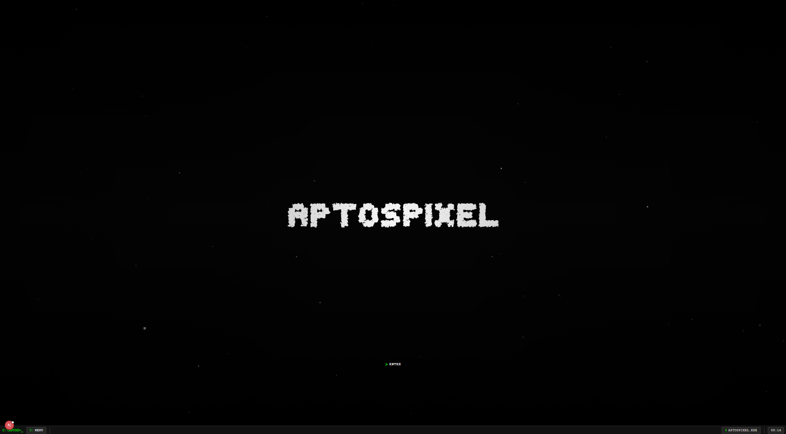
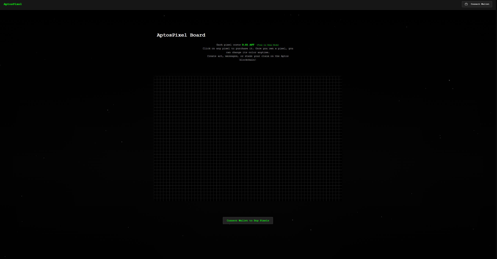
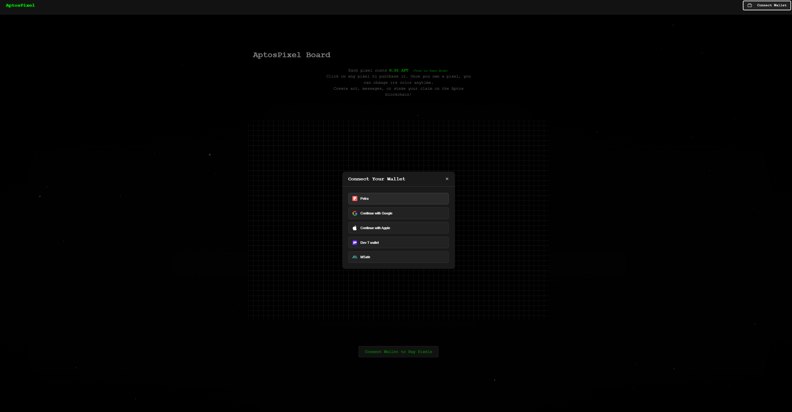
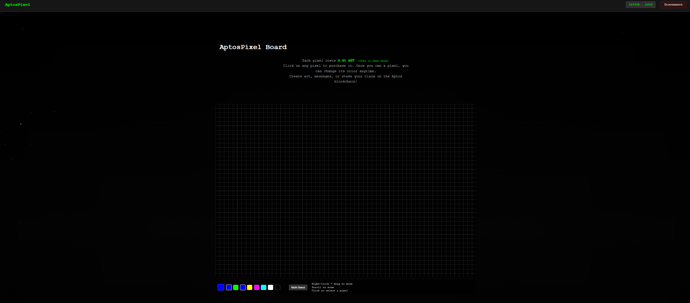
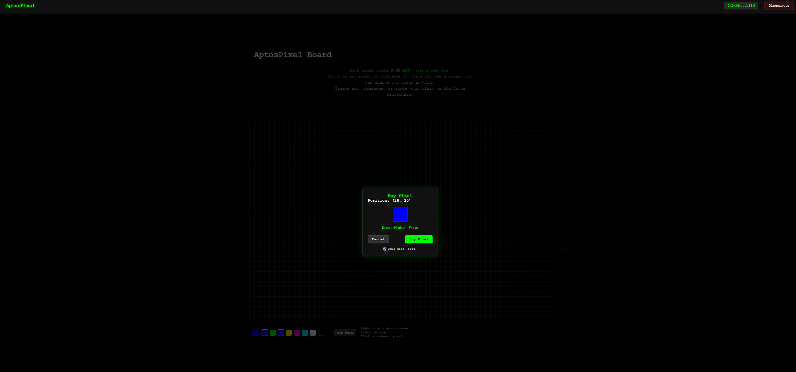
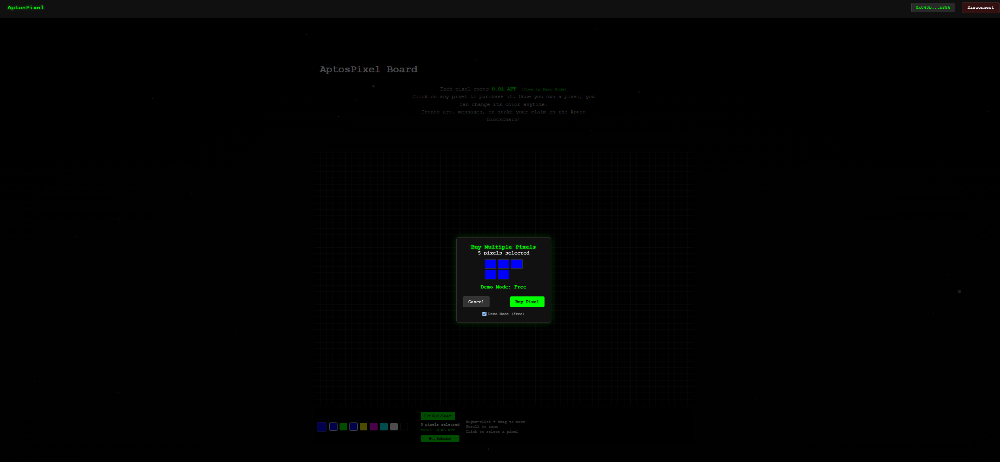

# AptosPixel - Decentralized Pixel Board

AptosPixel is a decentralized pixel art platform built on the Aptos blockchain. Users can purchase, own, and customize individual pixels on one large canvas, creating collaborative artwork that lives on the blockchain.









Video Demo: https://www.loom.com/share/3eb900e79e9345f7bb2611b4b7952cca?sid=40424c8b-bdcc-4bd2-948c-9c36eff6570f 


## Features

- **Pixel Ownership**: Purchase pixels for 0.01 APT each
- **Customization**: Change the color of pixels you own
- **Permanence**: All pixel data is stored on the Aptos blockchain
- **Interactive Canvas**: Zoom / navigate the pixel board
- **Wallet Integration**: Seamless connection with Aptos wallets

## Technical Overview

AptosPixel shows how to build a decentralized application that combines interactive web technologies with blockchain ownership. The project consists of:

1. **Smart Contracts**: Written in Move for the Aptos blockchain
2. **Frontend**: Built with Next.js and React
3. **Blockchain Integration**: Using the Aptos SDK and wallet adapters

## Technical Implementation

### Smart Contracts (Move)

The core of AptosPixel is a Move module that manages pixel ownership and attributes:

```
module pixel_board_admin::PixelBoard {
    // Board dimensions (1 000 x 1 000 = 1 000 000 pixels)
    const WIDTH:  u64 = 1_000;
    const HEIGHT: u64 = 1_000;

    // Price per pixel in **octas** (0.01 APT = 1 000 000 octas)
    const PRICE_PER_PIXEL: u64 = 1_000_000;

    // A single pixel
    struct Pixel has copy, drop, store {
        owner: address,
        argb:  u32,          // 0xAARRGGBB
        link:  vector<u8>,   // up to 64 bytes
    }

    // Board lives as one resource that owns the Table
    struct Board has key {
        pixels: table::Table<u64, Pixel>,
        buy_events: event::EventHandle<PixelBoughtEvent>,
        update_events: event::EventHandle<PixelUpdatedEvent>,
    }
}
```

The Move contract provides:
- A table structure to store pixel data
- Functions for buying, updating, and viewing pixels
- Events emitted for pixel purchases and updates
- Access control to ensure only owners can update their pixels

### Frontend

The frontend provides an interactive interface for the pixel board:

- Canvas rendering with pan and zoom capabilities
- Pixel selection and color picking
- Purchase UI for buying pixels
- Wallet connection and transaction handling

### Blockchain Integration

The application connects to the Aptos blockchain using:

- **Aptos SDK**: For transaction creation and submission
- **Wallet Adapter**: For connecting to user wallets and signing transactions
- **Resource Fetching**: For retrieving pixel data from the blockchain

## Technologies Used

### Frontend
- **Next.js**: React framework for the web application
- **TypeScript**: For type-safe code
- **Canvas API**: For rendering the pixel board
- **CSS Modules**: For component styling

### Blockchain
- **Aptos SDK**: For interacting with the Aptos blockchain
- **Aptos Wallet Adapter**: For wallet integration
- **Move Language**: For smart contract development

### Development Tools
- **Jest**: For testing
- **ESLint**: For code quality
- **Prettier**: For code formatting

### Prerequisites

- Node.js 16+
- Aptos wallet (Petra, Martian, etc.)
- Aptos testnet or mainnet APT for purchasing pixels

### Installation

1. Clone the repository:
```bash
git clone https://github.com/yourusername/AptosPixel.git
cd AptosPixel
```

2. Install dependencies:
```bash
npm install
```

3. Configure environment variables:
```
NEXT_PUBLIC_APTOS_NODE_URL=https://fullnode.testnet.aptoslabs.com
NEXT_PUBLIC_PIXEL_BOARD_ADDRESS=0x...
```

4. Run the development server (client side):
```bash
npm run dev
```

5. Open [http://localhost:3000](http://localhost:3000) in your browser.

## Deployment

The application can be deployed to any hosting service that supports Next.js applications:

```bash
npm run build
npm run start
```

## Future Enhancements

- Pixel grouping for creating larger artwork
- Auction system for popular pixel locations
- Time-based pixel rentals
- Integration with NFT marketplaces
- Mobile-optimized interface

## License

This project is licensed under the MIT License - see the LICENSE file for details.
